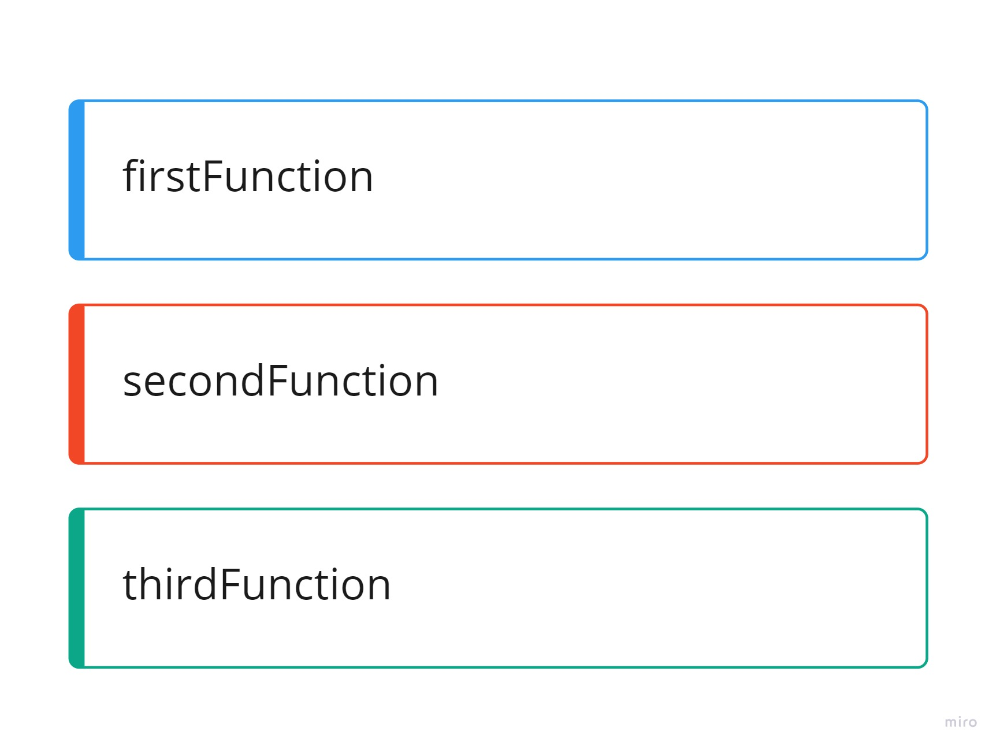

# Reading

[Understanding the JavaScript Call Stacks](codefellows.org/courses/code-201/foundations-of-software-development/)

1. What is a ‘call’?

    A function invocation

2. How many ‘calls’ can happen at once?

    One at a time

3. What does LIFO mean?

    Last in, first out, which means that the last function that gets pushed into the stack is the first to be popped out when the function returns.

4. Draw an example of a call stack and the functions that would need to be invoked to generate that call stack.

    

    ```Javascript
    function firstFunction(){
    //Business Logic
    }

    function secondFunction(){
    firstFunction();
    }

    function thirdFunction(){
    secondFunction();
    }

    thirdFunction();
    ```

5. What causes a Stack Overflow?

    When the call stack runs into the heap, usually with a runaway recursive process

[JavaScript Error Messsages](https://codeburst.io/javascript-error-messages-debugging-d23f84f0ae7c)

1. What is a ‘reference error’?

    Using variables or functions that are not yet declared

2. What is a ‘syntax error’?

    Some sort of syntax that can't be parsed into valid code

3. What is a ‘range error’?

    Trying to manipulate an object with some kind of length and the range is invalid, such as for negative length arrays

4. What is a ‘type error’?

    Like the name indicates, these types of errors show up when the types (number, string and so on) you are trying to use or access are incompatible, like accessing a property in an *undefined* type of variable

5. What is a breakpoint?

    A "pause" at some point in your code at a specific line

6. What does the word ‘debugger’ do in your code?

    The `debugger` keyword stops the execution of JavaScript, and calls (if available) the debugging function.

    This has the same function as setting a breakpoint in the debugger.

## Things I want to know more about

1. How does the event loop work in Node? There's no browser to speak of, so does Node give the Web API/timeout/other functionality that adds things to the task queue?
2. I'd never heard of hte Temporal Dead Zone, which is a cool term.
3. I had no idea you could do conditional breakpoints in the developer tools. That's so useful holy crap.
