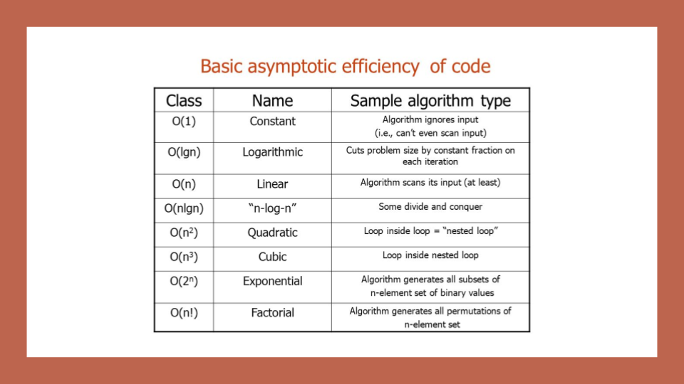

# Read: Class 05

## **Big O Notation Cheat Sheet**

I. **Introduction to Big O Notation**

- Big O notation is used to describe the efficiency of an algorithm or function.
- It evaluates the worst-case scenario in terms of time and space complexity.
- Key areas to consider when analyzing algorithm efficiency: Input Size, Units of Measurement, Orders of Growth, and Best Case, Worst Case, and Average Case.

II. **Factors Affecting Algorithm Efficiency**

1. *Running Time (Time Efficiency/Complexity)*
    - The amount of time an algorithm takes to complete its task.
    - Influenced by input size and the number of operations performed.

2. *Memory Space (Space Efficiency/Complexity)*
    - The amount of memory resources an algorithm uses to store data and instructions.
    - Influenced by the size of data structures and the amount of temporary storage required.

III. **Key Areas for Analysis**

1. *Input Size*
    - Represented by the variable 'n', it refers to the total size of values used as parameters in an algorithm.
    - Affects the running time and memory space requirements of an algorithm.

2. *Units of Measurement*
    - Refers to the standard units used for measuring time and space complexity.
    - Common units include milliseconds for time and bytes for space.

3. *Orders of Growth*
    - The rate at which an algorithm's time or space complexity increases with input size.
    - Described using Big O notation (e.g., O(n), O(n^2), O(log n)).

    

4. *Best Case, Worst Case, and Average Case*
    - Best Case (Big Omega): The most efficient scenario for an algorithm to perform its task.
    - Worst Case (Big O): The least efficient scenario for an algorithm to perform its task.
    - Average Case (Big Theta): The typical or random case used for analysis of algorithm efficiency.

IV. **Recap**

- Big O: Represents the worst-case analysis of algorithm efficiency.
- Running Time: The amount of time required for an algorithm to complete.
- Memory Space: The amount of memory resources required for an algorithm to complete.
- Input Size: Represented by the variable 'n', the total size of values used as parameters in an algorithm.
- Big Omega: Represents the best-case analysis of algorithm efficiency.
- Big Theta: Represents the typical or random case used for analysis of algorithm efficiency.

V. **Additional Information (from Overview)**

- To optimize an algorithm, focus on reducing its time and space complexity.
- Analyzing the efficiency of an algorithm helps in selecting the most appropriate algorithm for a specific problem or input size.
- Understanding the orders of growth can aid in predicting the performance of an algorithm as the input size increases.

## **Linked Lists Cheat Sheet**

I. **Introduction to Linked Lists**

- A linear data structure consisting of a sequence of elements called nodes.
- Each node points to the next node in the list (Singly Linked List) or to the next and previous nodes (Doubly Linked List).
- The first node is called the head, and the last node is called the tail.
- The tail node points to null, indicating the end of the list.

II. **Node Structure**

- A node contains two properties (Singly Linked List): data (or value) and next.
- A node contains three properties (Doubly Linked List): data (or value), next, and prev.
- *Data*: Stores the value of the node.
- *Next*: A reference to the next node in the list.
- *Prev*: A reference to the previous node in the list (Doubly Linked List only).

III. **Basic Operations on Linked Lists**

1. *Insertion*
   - Add a new node to the list.
   - Three possible scenarios: at the beginning (head), at the end (tail), or in the middle.
   - Time complexity: O(1) for head, O(n) for tail or middle.

2. *Deletion*
   - Remove a node from the list by updating the 'next' pointers of adjacent nodes (Singly Linked List) or both 'next' and 'prev' pointers (Doubly Linked List).
   - Time complexity: O(1) for head, O(n) for tail or middle.

3. *Search*
   - Traverse the list to find a specific node based on its data.
   - Time complexity: O(n).

4. *Traversal*
   - Iterate through the list from the head node to the tail node.
   - Time complexity: O(n).

IV. **Doubly Linked Lists**

- A variation of linked lists that allows traversal in both directions (forward and backward).
- Each node has a 'prev' pointer in addition to the 'next' pointer.
- Insertion and deletion operations are slightly more complex due to the need to update both 'next' and 'prev' pointers.
- Useful for specific use cases like managing a list that requires frequent insertions and deletions at arbitrary positions.
