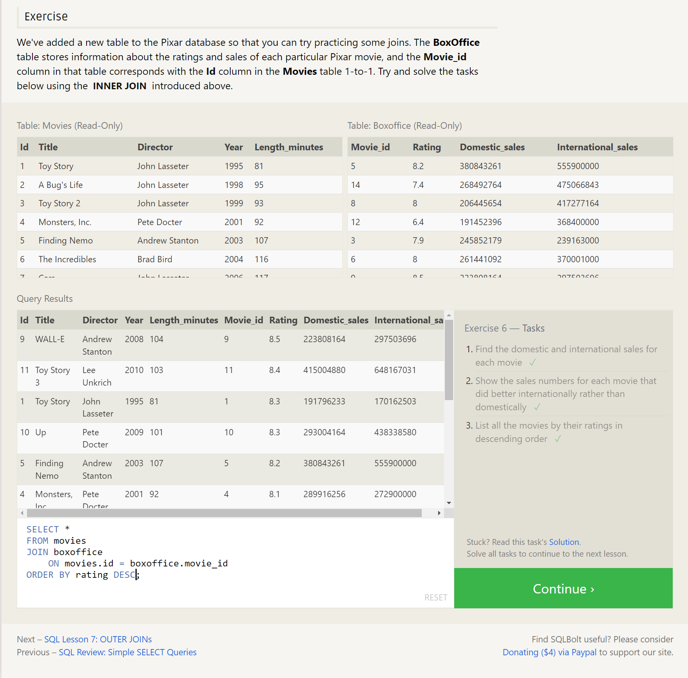

# SQL

## What is SQL?

SQL, or Structured Query Language, is a language designed to allow both technical and non-technical users query, manipulate, and transform data from a relational database. And due to its simplicity, SQL databases provide safe and scalable storage for millions of websites and mobile applications.

## Common SQL Databases

1. MySQL: It is an open-source SQL database management system that is widely used in web development.

2. Microsoft SQL Server: It is a relational database management system developed by Microsoft. It is widely used in enterprise-level applications and supports a variety of programming languages.

3. Oracle Database: It is a proprietary SQL database management system that is used in enterprise-level applications. It offers a wide range of features, including high availability, security, and scalability.

4. PostgreSQL: It is an open-source SQL database management system that is known for its advanced features and ability to handle complex queries.

5. SQLite: It is a lightweight SQL database management system that is often used in mobile applications and embedded systems.

6. IBM DB2: It is a relational database management system developed by IBM. It is widely used in enterprise-level applications and supports a variety of programming languages.

7. MariaDB: It is a community-developed, open-source fork of the MySQL database management system. It is designed to be a drop-in replacement for MySQL and offers many additional features.

## What is a Relational Database?

 A relational database represents a collection of related (two-dimensional) tables. Each of the tables are similar to an Excel spreadsheet, with a fixed number of named columns (the attributes or properties of the table) and any number of rows of data.

## SQL Lessons

### Lesson 1 - SELECT Queries 101

To retrieve data from a SQL database, we need to write `SELECT` statements, which are often colloquially refered to as queries. A query in itself is just a statement which declares what data we are looking for, where to find it in the database, and optionally, how to transform it before it is returned.

```sql
Select query for a specific columns
SELECT column, another_column, …
FROM mytable;
```

If we want to retrieve absolutely all the columns of data from a table, we can then use the asterisk (*) shorthand in place of listing all the column names individually.

This query, in particular, is really useful because it's a simple way to inspect a table by dumping all the data at once.


### Lesson 2: Queries with constraints (Pt. 1)

In order to filter certain results from being returned, we need to use a WHERE clause in the query. The clause is applied to each row of data by checking specific column values to determine whether it should be included in the results or not.

```sql
SELECT column, another_column, …
FROM mytable
WHERE condition
    AND/OR another_condition
    AND/OR …;
```

| Operator            | Condition                                            | SQL Example                |
| ------------------- | ---------------------------------------------------- | -------------------------- |
| =, !=, < <=, >, >=  | Standard numerical operators                         | col_name != 4              |
| BETWEEN … AND …     | Number is within range of two values (inclusive)     | col_name BETWEEN 1.5 AND 10.5 |
| NOT BETWEEN … AND … | Number is not within range of two values (inclusive) | col_name NOT BETWEEN 1 AND 10 |
| IN (…)              | Number exists in a list                              | col_name IN (2, 4, 6)       |
| NOT IN (…)          | Number does not exist in a list                      | col_name NOT IN (1, 3, 5)   |

*As you might have noticed by now, SQL doesn't require you to write the keywords all capitalized, but as a convention, it helps people distinguish SQL keywords from column and tables names, and makes the query easier to read.*


### Lesson 3 - Queries with constraints (Pt. 2)

When writing `WHERE` clauses with columns containing text data, SQL supports a number of useful operators to do things like case-insensitive string comparison and wildcard pattern matching.

| Operator | Condition                                            | Example                           |
| -------- | ---------------------------------------------------- | --------------------------------- |
| =        | Case sensitive exact string comparison               | col_name = "abc"                  |
| != or <> | Case sensitive exact string inequality comparison    | col_name != "abcd"                |
| LIKE     | Case insensitive exact string comparison             | col_name LIKE "ABC"               |
| NOT LIKE | Case insensitive exact string inequality comparison | col_name NOT LIKE "ABCD"          |
| %        | Used anywhere in a string to match a sequence of zero or more characters (only with LIKE or NOT LIKE) | col_name LIKE "%AT%" (matches "AT", "ATTIC", "CAT" or even "BATS") |
| _        | Used anywhere in a string to match a single character (only with LIKE or NOT LIKE) | col_name LIKE "AN_" (matches "AND", but not "AN") |
| IN (…)   | String exists in a list                              | col_name IN ("A", "B", "C")       |
| NOT IN (…)| String does not exist in a list                      | col_name NOT IN ("D", "E", "F")   |

While most database implementations are quite efficient when using these operators, full-text search is best left to dedicated libraries like **Apache Lucene** or **Sphinx**. These libraries are designed specifically to do full text search, and as a result are more efficient and can support a wider variety of search features including internationalization and advanced queries.


### Lesson 4 - Filtering and Sorting Query Results

The `DISTINCT` keyword is used in SQL to retrieve only unique values from a column. It is used in the `SELECT` statement to ensure that the result set only contains distinct (unique) values.

```sql
SELECT DISTINCT column, another_column, …
FROM mytable
WHERE condition(s);
```

The GROUP BY keyword is used to group rows with the same values in one or more columns into summary rows. It is often used with aggregate functions such as `COUNT`, `SUM`, `AVG`, `MAX`, and `MIN` to group and summarize data. The `GROUP` BY clause is used in the `SELECT` statement and specifies which columns to group by.

QL provides a way to sort your results by a given column in ascending or descending order using the `ORDER BY` clause.

```sql
SELECT column, another_column, …
FROM mytable
WHERE condition(s)
ORDER BY column ASC/DESC;
```

Another clause which is commonly used with the `ORDER BY` clause are the `LIMIT` and `OFFSET` clauses, which are a useful optimization to indicate to the database the subset of the results you care about.
The `LIMIT` will reduce the number of rows to return, and the optional `OFFSET` will specify where to begin counting the number rows from.

```sql
SELECT column, another_column, …
FROM mytable
WHERE condition(s)
ORDER BY column ASC/DESC
LIMIT num_limit OFFSET num_offset;
```


### Lesson  5 - Simple SELECT Queries Review

```sql
SELECT query
SELECT column, another_column, …
FROM mytable
WHERE condition(s)
ORDER BY column ASC/DESC
LIMIT num_limit OFFSET num_offset;
```


### Lesson 6 - Multi-table queries with JOINs

Database normalization is useful because it minimizes duplicate data in any single table, and allows for data in the database to grow independently of each other (ie. Types of car engines can grow independent of each type of car). As a trade-off, queries get slightly more complex since they have to be able to find data from different parts of the database, and performance issues can arise when working with many large tables.

In order to answer questions about an entity that has data spanning multiple tables in a normalized database, we need to learn how to write a query that can combine all that data and pull out exactly the information we need.

Using the `JOIN` clause in a query, we can combine row data across two separate tables using this unique key. The first of the joins that we will introduce is the `INNER JOIN`.

```sql
SELECT column, another_table_column, …
FROM mytable
INNER JOIN another_table 
    ON mytable.id = another_table.id
WHERE condition(s)
ORDER BY column, … ASC/DESC
LIMIT num_limit OFFSET num_offset;
```

_Did you know?_

You might see queries where the `INNER JOIN` is written simply as a `JOIN`. These two are equivalent, but we will continue to refer to these joins as inner-joins because they make the query easier to read once you start using other types of joins, which will be introduced in the following lesson.



### Lesson 13 - Inserting Rows

In SQL, the *database schema* is what describes the structure of each table, and the datatypes that each column of the table can contain.

This fixed structure is what allows a database to be efficient, and consistent despite storing millions or even billions of rows.

#### Inserting New Data

When inserting data into a database, we need to use an `INSERT` statement, which declares which table to write into, the columns of data that we are filling, and one or more rows of data to insert. In general, each row of data you insert should contain values for every corresponding column in the table. You can insert multiple rows at a time by just listing them sequentially.

```sql
INSERT INTO mytable
(column, another_column, …)
VALUES (value_or_expr, another_value_or_expr, …),
      (value_or_expr_2, another_value_or_expr_2, …),
      …;
```

In some cases, if you have incomplete data and the table contains columns that support default values, you can insert rows with only the columns of data you have by specifying them explicitly.


### Lesson 14 - Updating Rows

In addition to adding new data, a common task is to update existing data, which can be done using an `UPDATE` statement. Similar to the `INSERT` statement, you have to specify exactly which table, columns, and rows to update. In addition, the data you are updating has to match the data type of the columns in the table schema.

```sql
UPDATE mytable
SET column = value_or_expr, 
    other_column = another_value_or_expr, 
    …
WHERE condition;
```

The statement works by taking multiple column/value pairs, and applying those changes to each and every row that satisfies the constraint in the WHERE clause.

#### Taking Care

Most people working with SQL will make mistakes updating data at one point or another. Whether it's updating the wrong set of rows in a production database, or accidentally leaving out the `WHERE` clause (which causes the update to apply to all rows), you need to be extra careful when constructing `UPDATE` statements.

One helpful tip is to always write the constraint first and test it in a `SELECT` query to make sure you are updating the right rows, and only then writing the column/value pairs to update.


### Lesson 15 - Deleting Rows

When you need to delete data from a table in the database, you can use a `DELETE` statement, which describes the table to act on, and the rows of the table to delete through the `WHERE` clause.

```sql
DELETE FROM mytable
WHERE condition;
```

If you decide to leave out the WHERE constraint, then all rows are removed, which is a quick and easy way to clear out a table completely (if intentional).


### Lesson 16 - Creating Tables

When you have new entities and relationships to store in your database, you can create a new database table using the `CREATE TABLE` statement.

```sql
CREATE TABLE IF NOT EXISTS mytable (
    column DataType TableConstraint DEFAULT default_value,
    another_column DataType TableConstraint DEFAULT default_value,
    …
);
```

The structure of the new table is defined by its *table schema*, which defines a series of columns. Each column has a name, the type of data allowed in that column, an *optional* table constraint on values being inserted, and an optional default value.

If there already exists a table with the same name, the SQL implementation will usually throw an error, so to suppress the error and skip creating a table if one exists, you can use the IF NOT EXISTS clause.

#### Table Data Types

| Data type                    | Description                                                                                                                                                                |
| ----------------------------| -------------------------------------------------------------------------------------------------------------------------------------------------------------------------- |
| INTEGER, BOOLEAN             | The integer datatypes can store whole integer values like the count of a number or an age. In some implementations, the boolean value is just represented as an integer value of just 0 or 1.  |
| FLOAT, DOUBLE, REAL          | The floating point datatypes can store more precise numerical data like measurements or fractional values. Different types can be used depending on the floating point precision required for that value. |
| CHARACTER(num_chars), VARCHAR(num_chars), TEXT | The text based datatypes can store strings and text in all sorts of locales. The distinction between the various types generally amount to underlaying efficiency of the database when working with these columns. Both the CHARACTER and VARCHAR (variable character) types are specified with the max number of characters that they can store (longer values may be truncated), so can be more efficient to store and query with big tables. |
| DATE, DATETIME               | SQL can also store date and time stamps to keep track of time series and event data. They can be tricky to work with especially when manipulating data across timezones. |
| BLOB                         | Finally, SQL can store binary data in blobs right in the database. These values are often opaque to the database, so you usually have to store them with the right metadata to requery them. |

### Table Data Constraints

We aren't going to dive too deep into table constraints in this lesson, but each column can have additional table constraints on it which limit what values can be inserted into that column. This is not a comprehensive list, but will show a few common constraints that you might find useful.

| Constraint     | Description                                                                                                    |
| -------------- | -------------------------------------------------------------------------------------------------------------- |
| PRIMARY KEY    | This means that the values in this column are unique, and each value can be used to identify a single row in this table.                |
| AUTOINCREMENT  | For integer values, this means that the value is automatically filled in and incremented with each row insertion. Not supported in all databases.  |
| UNIQUE         | This means that the values in this column have to be unique, so you can't insert another row with the same value in this column as another row in the table. Differs from the `PRIMARY KEY` in that it doesn't have to be a key for a row in the table. |
| NOT NULL       | This means that the inserted value cannot be `NULL`.                                                           |
| CHECK (expression) | This allows you to run a more complex expression to test whether the values inserted are valid. For example, you can check that values are positive, or greater than a specific size, or start with a certain prefix, etc. |
| FOREIGN KEY    | This is a consistency check which ensures that each value in this column corresponds to another value in a column in another table. For example, if there are two tables, one listing all Employees by ID, and another listing their payroll information, the `FOREIGN KEY` can ensure that every row in the payroll table corresponds to a valid employee in the master Employee list. |

Here's an example schema for the Movies table that we've been using in the lessons up to now.

```sql
CREATE TABLE movies (
    id INTEGER PRIMARY KEY,
    title TEXT,
    director TEXT,
    year INTEGER, 
    length_minutes INTEGER
);
```


### Lesson 17 - Altering Tables

As your data changes over time, SQL provides a way for you to update your corresponding tables and database schemas by using the `ALTER TABLE` statement to add, remove, or modify columns and table constraints.

#### Adding Columns

The syntax for adding a new column is similar to the syntax when creating new rows in the `CREATE TABLE` statement. You need to specify the data type of the column along with any potential table constraints and default values to be applied to both existing and new rows. In some databases like MySQL, you can even specify where to insert the new column using the `FIRST` or `AFTER` clauses, though this is not a standard feature.

```sql
ALTER TABLE mytable
ADD column DataType OptionalTableConstraint 
    DEFAULT default_value;
```

#### Removing Columns

```sql
ALTER TABLE mytable
DROP column_to_be_deleted;
```

#### Renaming the Table

```sql
ALTER TABLE mytable
RENAME TO new_table_name;
```


### Lesson 18 - Dropping Tables

In some rare cases, you may want to remove an entire table including all of its data and metadata, and to do so, you can use the `DROP TABLE` statement, which differs from the `DELETE` statement in that it also removes the table schema from the database entirely.

Like the `CREATE TABLE` statement, the database may throw an error if the specified table does not exist, and to suppress that error, you can use the `IF EXISTS` clause.

In addition, if you have another table that is dependent on columns in table you are removing (for example, with a `FOREIGN KEY` dependency) then you will have to either update all dependent tables first to remove the dependent rows or to remove those tables entirely.


